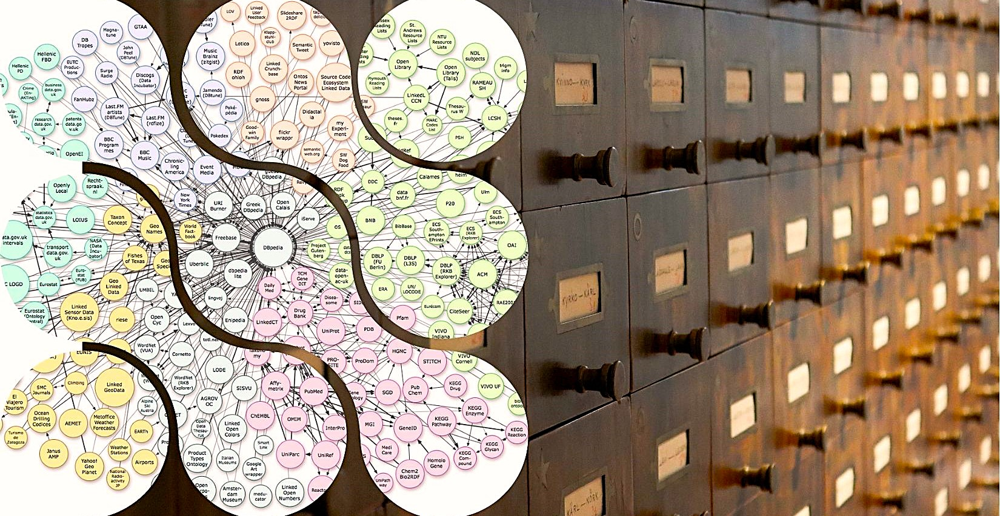
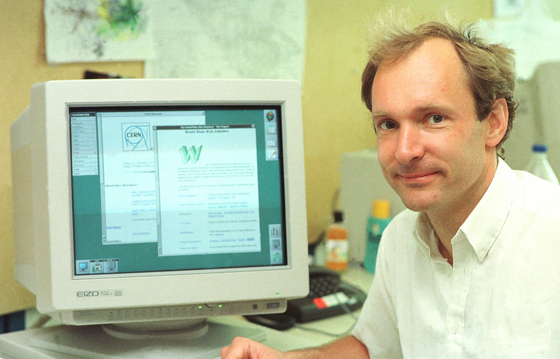
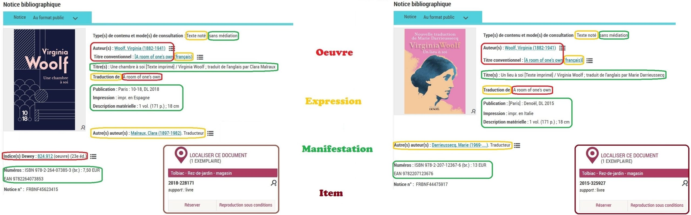
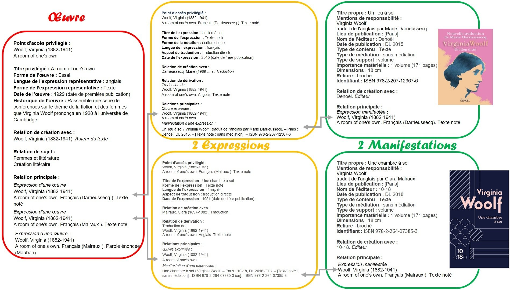
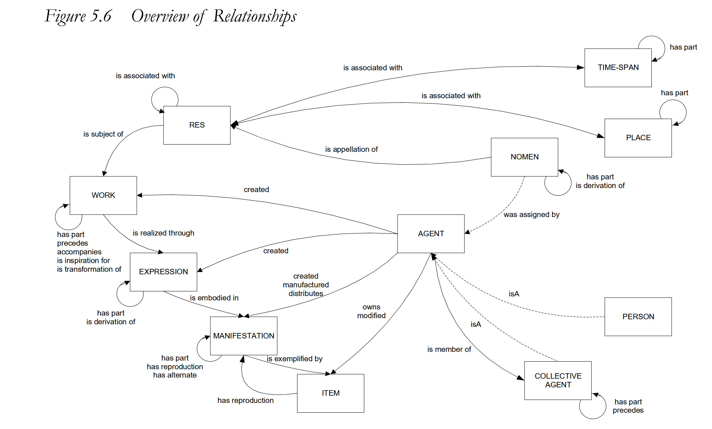
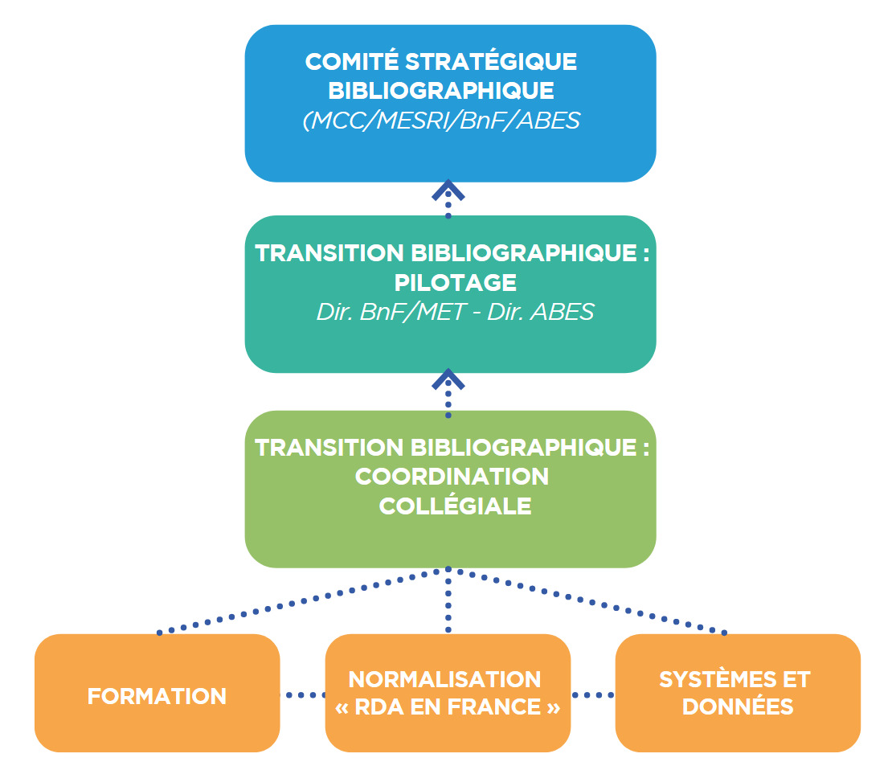

# La transition bibliographique en France, « des catalogues vers le web de données » 

---

 

<I>
Source : Carte des bases de données du projet Linked Open Data, disponible sur le 
<a href="https://www.flickr.com/photos/itupictures/16662336315">Portail Web Sémantique de Wikipédia</a> 
et vue d'un meuble à fiches d'une bibliothèque par 
<a href="https://unsplash.com/fr/photos/un-gros-plan-dun-ordinateur-ST4jAHVCEZQ">D. Forsman sur Unsplash</a>
</I>

---

## Introduction - Dans l'historique des catalogues : des _Principes de Paris_ à la transition bibliographique, une adaptabilité perpétuelle

« L’ "ouvrage bibliographique" a constamment été remis sur le métier » écrit en 2017 le conservateur général des bibliothèques Grégory Miura[^1], précisant que  « le catalogage reste une pierre angulaire de notre métier non par la permanence de sa structure, acquise de fraîche date, mais bien par **la vitalité d'un chantier intrinsèquement actif**. » En effet, conséquence de l'évolution des supports et canaux de la connaissance, l’histoire des catalogues de bibliothèque, à la fois outils de gestion et espaces d’interaction avec les usagers, est celle d’adaptations constantes pour rendre visibles et intelligemment accessibles les informations dont les bibliothèques disposent, physiquement ou numériquement. Car les catalogues actuels sont déjà la conséquence d’une première transition bibliographique visant à une **normalisation internationale du catalogage**, démarrée avec l’adoption des [**_Principes de Paris_**](https://www.ifla.org/files/assets/cataloguing/IMEICC/IMEICC1/statement_principles_paris_1961-fr.pdf) en octobre 1961, et concrétisée sur le territoire français par une série de normes (Z44) entre 1988 et 2007. D'après ces principes, le catalogue doit permettre (1) de savoir si la bibliothèque dispose d'un livre particulier, et (2) d'identifier les œuvres d'un auteur donné disponibles dans le fonds, en précisant l'édition. Pour cela, chaque livre est associé à une ou plusieurs notices descriptives, recensant toutes les indications jugées indispensables à l'identification d'un ouvrage. Mais ces standards apparaissent vite dépassés dès le tournant du XXIe siècle, alors que la multiplication des « nouveaux supports » (documents sonores, vidéocassettes…) et l’explosion du fait numérique reposent la question des formats bibliographiques et de leurs objectifs. En 1990, à Stockholm, le _Séminaire sur les notices bibliographiques_ commandé par la Fédération internationale des associations et institutions de bibliothèques ([IFLA](https://www.ifla.org/about/)) débouche ainsi sur la conceptualisation d'un modèle entité-association d'organisation des données bibliographiques, les règles **FRBR** (_Functional Requirements of Bibliographic Records_), achevées en 1997 et publiées l'année suivante. Depuis 2015, la France a ainsi engagé un programme de « Transition bibliographique », volet national d’un mouvement mondial initié au cours des années 90. Polysémique, le terme de **transition bibliographique** renvoie ainsi tout à la fois à un projet et à son application technique. Au sens restreint, en France, il s’agit du programme national, lancé depuis 2014, de traduction et d’adaptation de **RDA** pour adapter les normes de documentation à l’évolution d’Internet et notamment permettre la **FRBRisation des catalogues**

# I. Percer les secrets de la transition bibliographique
 
## I.1. Des objectifs parfois ambigus : s’adapter à l’évolution numérique pour mieux servir l’usager, ou répondre à l'appel du big data ? 

>  « La nature de l'information, jusque-là conceptualisée à partir du modèle de l'imprimé, se transforme sous l'influence de la production numérique, à la fois fluide, diversifiée dans ses sources, ses contenus, ses formats, massive et hypertextualisée. (…) L'enjeu de la TB [Transition bibliographique] étant au final de concevoir et d'appliquer les principes, les méthodes et les outils qui permettront d'**injecter dans l'univers des données l'ensemble des artefacts documentaires collectés et décrits à ce jour**, quelle que soit leur forme ou leur origine », David Aymonin, directeur de l'Abes (Arabesques n°87, 2017, p. 03)

### Pourquoi la transition bibliographique ?
Comme le synthétise David Aymonin, la transition bibliographique poursuit deux objectifs complémentaires. Le premier répond à une logique de service : il s'agit de **restructurer la donnée bibliographique pour la rendre mieux exploitable aux regards des demandes des utilisateurs**, qu'ils soient étudiants, chercheurs, ou lecteurs des bibliothèques municipales. En effet, l'essor d'Internet a largement remodelé les pratiques de la recherche documentaire ; les moteurs de recherche sont d'une utilisation très intuitive : capables d'interpréter des requêtes aux formulations très variées, ils ont en conséquence pris largement le pas sur les applications dédiées. Dès lors, afin que les catalogues de bibliothèques demeurent des bases de connaissances et ne soient pas réduits à de simples outils de localisation des ressources, il faudrait pouvoir **interroger le catalogue** à la manière d'un moteur de recherche, pour accéder plus rapidement à une information précise, qu'elle porte directement sur les collections d'une bibliothèque ou non : « (…) quand l'usager demande un auteur, un lieu ou un titre, il importe de lui fournir ce qu'il demande, et non plus seulement une liste de notices décrivant des documents au sein de laquelle il découvrira peut-être sa réponse » (Frédérique Joannec-Seta et David Aymonin, p. 06). Autrement dit, le catalogue ne doit plus se concevoir comme le reflet de la collection physique d'une institution, mais comme un gisement de données en propre, permettant la recherche et l'exploitation d'informations au-delà de celles servant à l'étiquetage d'un exemplaire précis. La variété des usages que l'on pourrait en faire est illustrée par une série de dialogues fictifs, issus d'une [infographie](https://www.transition-bibliographique.fr/wp-content/uploads/2022/10/infographie-TB.pdf) destinée à vulgariser les enjeux de la transition bibliographique auprès du grand public : 

> « - Pour ma thèse en histoire, j’ai besoin de la liste complète des éditions de Voltaire au XVIIIe siècle.  
    - _Il vous suffit de chercher la fiche Voltaire issue du fichier national des entités._ »  
  « - J’aimerais connaître les principaux auteurs ayant travaillé sur la chimie moléculaire.  
    - _Une recherche par sujet me permettra de vous dire quels sont les auteurs les plus souvent associés à ce sujet._ »
  « - Pour mon exposé sur Darwin, commençons par une recherche Google…  
    - _Tiens, il y a des documents sur le sujet à la bibliothèque. C’est donc à cela qu’elle sert ?_ »  
  « - Ce livre a l’air intéressant, qu’en pense Google ?   
    - Il est dans la bibliothèque près de chez moi !! »

En effet, les catalogues brassent une somme extrêmement importantes de "métadonnées", qui sont en réalité des données  parfois recherchées pour elles-mêmes, mais actuellement sous-exploitées car mal liées entre elles. En ce sens, la transition bibliographique s'inscrit très nettement dans la constitution et l'horizon d'un **web sémantique**, mentionné pour la première fois en 2001 par Tim Berners-Lee, James Hendler et Ora Lassila dans [un article fondateur](https://www.lassila.org/publications/2001/SciAm.pdf) et qui « repose sur l'établissement de **liens directs et signifiants**, c'est-à-dire interprétables par une machine, de (méta)donnée à (méta)donnée au sein d'un "**web de données**" » (Philippe le Pape, Arabesques 2017, p.05). 

---

<I><B>Tim Berners-Lee</B>, Source : </I><a href="https://www.flickr.com/photos/itupictures/16662336315">Flickr</a>

---
	
## I.2. Les défis de la mise en œuvre technique en France 
	
Que l'objectif final soit la visibilité ou le service aux usagers (l'un n'excluant pas l'autre), l'intégration des catalogues de bibliothèque au web de données nécessite de nouveaux cadres conceptuels (FRBR, IFLA-LRM) tout autant que de nouveaux protocoles et de nouvelles opérations (production de métadonnées, utilisation de référentiels d'autorités). Définition et adoption de ces nouvelles manières de faire engendrent par voie de conséquence des mutations techniques, les systèmes informatiques de gestion des bibliothèques (SIGB) devant adapter leurs structures de bases de données pour les rendre compatibles. 

### I.2.1. FRBR, IFLA-LRM, RDA-FR… au cœur de la machine 

#### I.2.1.1. À la source : [le modèle FRBR](http://www.enssib.fr/bibliotheque-numerique/documents/65520-comprendre-le-modele-frbr-et-ses-extensions.pdf), texte fondateur de la transition bibliographique

> « (…) Si le catalogue d'une bibliothèque constituait auparavant une **base de notices attachées à des "documents", il se compose désormais d'un ensemble hétérogène de "données" prises dans des relatons signifiantes conceptualisées au moyen de la syntaxe RDF (…). **Plus qu'une simple description de documents isolés, le catalogage devient une opération de conceptualisation de liens** : les bibliothèques engagées dans la Transition bibliographique avancent de fait vers cet objectif de "sémantisation" des données de leurs catalogues. » ([Fiche pratique de l'Enssib](https://www.enssib.fr/bibliotheque-numerique/documents/67445-comprendre-les-enjeux-de-la-transition-bibliographique.pdf), Gabriel Raupp, 2016)

Ni norme, ni format de catalogage, les FRBR publiées par l'IFLA en 1998 sont une [modélisation conceptuelle](https://www.transition-bibliographique.fr/wp-content/uploads/2016/01/support_formation_modelisation_frbr.pdf) de l'information contenue dans les notices bibliographiques, pensée pour l'utilisateur afin de répondre aux enjeux précédemment évoqués. Jusqu'alors, une notice bibliographique correspondait à un gisement d'information décrivant une ressource physique donnée (CD, livre, affiche…) disponible au sein d'une institution. Progressivement se sont également constitués, pour certains systèmes, des fichiers dits "d'autorités" recensant des entités normalisées (par exemple des personnes ou des collectivités) et liés aux notices bibliographiques. C'est cette mise en relation que développent les FRBR : les ressources imprimées et numériques sont regroupées en quatre entités globales, via une réorganisation des informations contenues dans l'habituelle description d'un objet bibliographique. 
L'ensemble est synthétisé par le sigle **OEMI : Œuvre, Expression, Manifestation et Item**, censé pouvoir rendre compte de toute ressource bibliographique : une **œuvre** donnée (c'est-à-dire une création intellectuelle ou artistique, par exemple _Notre-Dame de Paris_, de Victor Hugo), peut avoir différentes **expressions** (le texte de Victor Hugo diffère entre sa première publication en 1831 et la seconde en 1832, où il est augmenté de trois chapitres, il a par ailleurs été traduit en langue étrangère, etc…). Ces expressions se matérialisent par différentes **manifestations** (il s'agit le plus souvent d'une publication), et chaque exemplaire isolé d'une manifestation est un **item** (par exemplaire, l'exemplaire Gallimard de Notre-Dame de Paris, dans la collection de la _Pléiade_, possédé précisément par la bibliothèque municipale du Plessis-Robinson en Île-de-France).

---

<I><B>Passage d'une logique de notices... : </B></I>
  

  

<I><B>... à une logique d'entités et de relations (catalogage par entités OEMI appliquant les règles RDA-FR) : </B></I>
   

  
 

<I> Source : site de la <a href="https://www.transition-bibliographique.fr/enjeux/definition-rda/">Transition bibliographique</a></I>
 

---

Les FRBR se cantonnent aux seules notices bibliographiques. En 1999 puis 2005, deux groupes d'experts sont constitués (FRANAR, _Functional Requirements and Numbering of Authority Records_ puis FRSAR, _Functional Requirements for Subject Authority Records_) pour étendre et affiner ce premier travail de modélisation… : 
- …<ins>Aux contenus des notices d'autorités</ins>, c'est-à-dire aux différents agents qui sont liés à une œuvre (par des opérations diverses : création, transformation, publication, possession…)  : c'est le modèle FRAD (_Functional Requirements for Authority Data_), [traduit en français par la BnF](https://multimedia-ext.bnf.fr/pdf/frad_rapport_final.pdf), concentré sur les relations entre les entités Personne, Collectivité, Famille et Oeuvre ;
- …<ins>Aux relations entre données bibliographiques et fichier d'autorité matière</ins>, dans l'objectif de préciser le contenu de l'œuvre elle-même. Le modèle [FRSAD](https://multimedia-ext.bnf.fr/pdf/frsad_rapport_final.pdf) (_Functional Requirements for Subject Authority Data_) vient ainsi analyser les liens entre une Œuvre donnée et les sujets qu'elle traite, ainsi que les informations contenues dans les systèmes d'indexation (qu'il s'agisse des concepts eux-mêmes que des appellations qui s'y réfèrent). 

Enfin, FRBR, FRAD et FRSAD ont fusionné en 2017 pour former le modèle unique [**IFLA-LRM**](https://www.ifla.org/files/assets/cataloguing/frbr-lrm/ifla-lrm-august-2017_rev201712.pdf) (_IFLA Library Reference Model_) sur lequel s'adosse le programme actuel de la Transition bibliographique en s'inscrivant plus directement dans une perspective de web de données. Il regroupe les trois niveaux d'entités (organisées en classes et sous-classes) précédemment évoqués : celui de l'œuvre ("groupe 1", très proche des OEMI de FRBR), celui des entités responsables du contenu ("groupe 2" : Personne, Famille, Collectivité, liées principalement à FRAD) et enfin celui des entités dites Sujet ("groupe 3": Concept, Objet, Évènement et Lieu), ainsi que l'illustre le schéma suivant : 

---

<I><B>Vue d'ensemble des relations dans le modèle IFLA-LRM</B>, Source : </I><a href="https://www.ifla.org/files/assets/cataloguing/frbr-lrm/ifla-lrm-august-2017_rev201712.pdf">IFLA Library Reference Model,</a> IFLA, 2017, p.86
 

---

Son architecture globale est censé répondre à cinq type d'opérations : **explorer, trouver, sélectionner, identifier, obtenir**, et correspond à un formalisme d'**ontologie**. Si IFLA-LRM répond aux deux objectifs de service à l'utilisateur et de visibilité des données, ce n'est cependant qu'un modèle conceptuel, général, et non pas une application. 

#### I.2.1.2. "L'adopter, c'est l'adapter", de RDA à [RDA-FR](https://www.transition-bibliographique.fr/enjeux/definition-rda/): le lancement du programme Transition bibliographique

De nouvelles règles ont donc vocation à progressivement remplacer les [normes de catalogage Afnor](https://www.bnf.fr/fr/normes-afnor-de-catalogage) jusqu'alors en cours, pour appliquer et concrétiser les nouvelles conceptualisations des données bibliographiques. En effet, puisqu'il ne s'agit plus de créer des liens entre des pages mais de « **lier des données structurées**, si possibles ouvertes et identifiées de manière pérenne » (selon la formulation de la fiche pratique de l'Enssib), il faut disposer d'une syntaxe normalisée et standardisée qui permette de le faire. En 2009 était déjà paru Reicat, puis l'année suivante RDA, _Ressource Description Framework_, créé par la Bibliothèque du Congrès avec une vocation internationale. Cependant, ce dernier code, basé quasi-exclusivement sur les FRBR et resté très proche des [AACR](http://www.aacr2.org/) américaines (_Anglo-American Cataloguing Rules_), n'est pas assez abouti selon l'Agence bibliographique de l'enseignement supérieur ([Abes](https://abes.fr/l-abes/presentation/)) et la Bibliothèque nationale de France ([BnF](https://www.bnf.fr/fr/missions-et-organisation-de-la-bnf)). En 2014, le choix est fait d'adapter progressivement le code RDA aux normes françaises, avec la rédaction de RDA-FR : c'est le lancement officiel du programme national de la transition bibliographique. 

> « (…) il est possible et préférable d'avancer **progressivement mais concrètement** vers la FRBRisation des catalogues sans attendre le grand soir de l'adoption de RDA. Cette approche conduit à ajuster l'organisation du travail existante au sein de RDA en France [_rq_ : le groupe de travail chargé d'évaluer le code RDA, pendant national du groupe européen EURIG], **renommé "Transition bibliographique"** afin d'inscrire la problématique de l'évolution des règles de catalogage dans un plus large mouvement d'évolution qui nécessite une démarche d'ensemble d'accompagnement au changement dans les établissements » ([Communiqué de presse](http://transition-bibliographique.fr/wp-content/uploads/2015/05/communique201411_transition_bibliographique.pdf) annonçant le lancement du programme Transition bibliographique, 2014)

Presque dix ans plus tard, dans un [communiqué de presse de novembre 2023](https://www.bnf.fr/sites/default/files/2023-11/cp_Transition_bibliographique_2023.pdf) l'Abes et la BnF réaffirment ainsi les trois axes du projet : « améliorer l'exposition des données bibliographiques françaises dans le web de données par l'application du modèle international de données IFLA-LRM  »  (qui a depuis 2017 remplacé FRBR et ses différentes évolutions, obligeant à une refonte du code de catalogage RDA), « adopter pour ce faire de nouvelles règles de signalement et de description des documents et des autorités y étant liées (auteurs, sujets, lieux…), dérivées du code de catalogage international RDA, le code RDA-FR » et enfin « préparer l'ensemble des acteurs de l'écosystème national à cette transition normative et technologique par des actions de communication, de sensibilisation et de formation ».

Au cœur de la transition bibliographique, le code RDA-FR doit donc permettre, par l'implémentation du modèle IFLA-LRM, de produire de meilleures métadonnées, essentielles dans la création et la diffusion de l'information bibliographique, de mieux s'adapter à l'information numérique en prenant en compte tout type de ressource et tout type de mode de recherche, mais également de mieux communiquer avec les réservoirs de données d'autres communautés productrices de savoir, en gagnant en **interopérabilité**.

#### I.2.1.3. Un temps long nécessaire
État intermédiaire entre deux paradigmes par définition, la « transition » bibliographique s'inscrit donc nécessairement sur le long terme, l'un de ses piliers fondamentaux étant l'idée de progressivité. La norme RDA-FR est rédigée et publiée chapitre après chapitre, au fur et à mesure de sa validation par le groupe AFNOR CN46-9, et doit être intégrée dans les formats de catalogage existants, nécessitant de nécessaires adaptations techniques ("les outils doivent tenir compte aussi bien des évolutions normatives que du changement de paradigme dans la production et la gestion des données"). Il s'agit aussi de former les catalogueurs au nouveau code, et de sensibiliser public et responsables d'établissements aux impacts de la transition bibliographiques et aux enjeux stratégiques, alors que le terme d'open data commence à s'imposer dans le débat courant. 

> « Le temps de la transition bibliographique est d'autant plus complexe que le contexte est celui de l'automatisation partielle des processus afin de traiter des lots de données de plus en plus volumineux ; ce travail sort du quotidien des informaticiens pour devenir celui des data librarians ; la production des métadonnées se répartie sur un nombre croissant d'acteurs » (Frédérique Joannic-Seta, David Aymonin)

### I.2.2. L’infrastructure institutionnelle 

Les acteurs de la transition bibliographique sont nombreux, regroupant tant des professionnels de bibliothèques et de centres d'archives, que des éditeurs d'applications et de logiciels professionnels. Le programme global est défini par le **Comité stratégique des bibliothèques**, rassemblant l'Abes et la BnF (les directeurs des deux agences bibliographiques nationales pilotant le projet), ainsi que des représentants de leurs deux ministères de tutelle, le **Ministère de la culture et de la communication** et le **Ministère de l'éducation nationale, de l'enseignement supérieur et de la recherche**. Ce comité se réunit deux fois par ans. Le projet est ensuite coordonné collégialement entre trois groupes de travail nationaux : Normalisation, Formation et Systèmes de données, échangeant périodiquement lors de réunions en assemblée plénière.

---

<I><B>Organigramme du programme Transition bibliographique</B>, Source : Arabesques n°87, 2017, p.07</I>
 

---
Sous l'égide de la commission « Identification et description » de l'AFNOR, le groupe « <ins><B>Normalisation pour l'adoption de RDA en France</B></ins> » a pour mission principale la rédaction et la publication de RDA-FR, en s'appuyant autant que possible sur RDA afin de rester proche de la communauté internationale des bibliothèques. Ainsi, l'équipe contribue parallèlement aux propositions portées par le groupe d'intérêt européen sur RDA **EURIG**, au **JCS** (le Comité conjoint de pilotage où siègent notamment la Bibliothèque du Congrès, la _British Library_, la Bibliothèque nationale d'Australie et la _Deutsche Nationalbibliothek_). 
Le principal enjeu est de réussir à conserver une **cohérence tout au long du code** (notamment en anticipant vers les parties non encore éditées) alors que la rédaction s'échelonne sur plusieurs années et qu'RDA est régulièrement mis à jour. La mise en conformité avec IFLA-LRM notamment obligeait à revenir en amont pour corriger les passages du code déjà édités, tout en anticipant le changement de vision des parties à venir. 
Par ailleurs, en amont de la publication, le groupe propose également des évolutions intermédiaires pour répondre à des besoins plus urgents et concrets et travaille en étroite collaboration avec le groupe **Formation** pour rédiger des documents pédagogiques, notamment en participant au [Guide pratique du catalogueur de la BnF](https://editions.bnf.fr/guide-pratique-du-catalogueur) et au [Guide méthodologique du Sudoc](https://documentation.abes.fr/sudoc/).

En effet, le groupe [**Formation**](https://www.transition-bibliographique.fr/se-former/modalites-pratiques/) mène en parallèle un important chantier de sensibilisation aux enjeux de la transition bibliographique et des évolutions de catalogage : il s'agit à la fois d'expliciter les tenants et aboutissants du programme, et d'accompagner la nécessaire montée en compétence des équipes-métiers de catalogueurs, la transition bibliographique remodelant à la fois la conception même du catalogage et les pratiques et techniques concrètes d'enregistrement de l'information bibliographique. 
Ce travail est mené de pair avec trois importants structures du monde de la documentation : le [**CRFCB**](https://www.crfcb.fr/#/)(Centre Régional de Formation aux Carrières des Bibliothèques), l'[**ENSSIB**](https://www.enssib.fr/)(l'Ecole Nationale Supérieures des Sciences de l'Information et des Bibliothèques) et le [**CNFPT**](https://www.cnfpt.fr/nous-connaitre/nos-missions/champs-daction/national) (Centre National de la Fonction Publique Territoriale). 

---

<I><B>Extrait d'un support de sensibilisation du CNFPT</B>, Source : </I><a href="https://www.cnfpt.fr/sites/default/files/transition_bibliographique-tb_def_logo_couleur_vf.pdf">site du CNFPT</a>

---
Enfin, en concertation avec les développeurs, le groupe <ins><B>Systèmes et données</B></ins> est chargé de la mise en place des outils professionnels permettant le passage à RDA, afin que puisse s'opérer la migration des données des catalogues actuels vers les catalogues respectant le nouveau cadre conceptuel de structuration de l'information bibliographique, l'enjeu étant à terme de pouvoir produire des données nativement « LRMisées ». Il s'agit de répondre sous l'angle informatique aux nombreuses questions pratiques que soulève la transition bibliographique : comment gérer la création des nouvelles entités et l'imbrication des différentes relations ? Il faut pouvoir faire évoluer les SIGB (Système Informatisé de Gestion des Bibliothèques) mais également les formats de données. 

### I.2.3. « MARC must die » : les métadonnées de l’avenir  

Outre le cadre de la description bibliographique (FRBR et IFLA-LRM) et les normes de catalogage (RDA-FR), le programme de la transition bibliographique invite également à réinterroger les formats dans lequel les données sont gérées, toutes variantes du **MARC** (_MAchine-Readable Cataloging_). Cette famille de formats d'échanges de données bibliographiques avait été développée sur demande de la Bibliothèque du Congrès à la fin des années 1960, aux débuts de l'informatique, pour [rendre les notices catalographiques lisibles par des machines](https://www.marc21.ca/M21/040010-237.1-f.html). 
Le MARC repose sur des grilles de saisie (on parle de « zones », dédiées à la saisie de l'auteur, du titre, de la cote…) attribuant des étiquettes ou balises à toutes les parties composant habituellement une notice de catalogage (par exemple, dans le format MARC21 employé par la Bibliothèque du Congrès, l'étiquette numérique **100** indique que la zone contient un nom de personne désigné comme vedette principale, c'est-à-dire le plus souvent un auteur, et l'étiquette **245** indique un titre). Plus précisément, MARC est moins un format informatique qu'une **norme de description bibliographique**, dont dépend la description, l'organisation et l'affichage des informations dans un catalogue de bibliothèque. Pour être exportées et chargées dans un autre catalogue, les informations bibliographiques écrites en MARC sont recodées selon la norme **ISO 2709**. Il existe de nombreuses variantes du MARC, dont UNIMARC et MARC21. 
Si une évolution du MARC est suggérée depuis longtemps (« MARC Must Die », écrivait Roy Tennant en 2002[^2]), il n'a jamais été sérieusement remis en cause, y compris lors du tournant de 2017 pour l'adoption d'IFLA-LRM. En effet, outre la nécessité de s'accorder à l'échelle de l'ensemble de la communauté, mettre en cause le MARC imposerait de convertir des millions de notices déjà encodées. Et pourtant, les défauts des formats MARC ne sont que trop visibles : formatés pour un regard humain, les données structurées en MARC se prêtent mal aux processus automatisés de traitement et de récupération [^3] et sont en conséquence peu compétitifs dans le web de données.

[^2]: Roy TENNANT, « MARC Must Die », _Library Journal - New York_, 127(17), 2002, p. 26-27
[^3]: « the reality is that the [MARC] format (…) has been primarily intended for the exchange and display of records and the data was, to a large degree, structured for human interpretation and not for automated processing and retrieval as it is required today », Seungmin LEE et Elin K. JACOB, « An Integrated Approach to Metadata Interoperability », _Library Resources & Technical Services_, 55(1), 2011, p.17-32

> « Le format de notices le plus répandu, nommé MARC, utilise un vocabulaire et une codification très spécifique au métier bibliographique, rendant difficile la réutilisation des données par d'autres acteurs. De plus, MARC est principalement dédié à la représentation de publications littéraires (ex., livres) comme on pourrait les imaginer sur une étagère. Ce paradigme reste malheureusement loin de la réalité numérique grandissante (ex., ebooks, web séries, podcasts) et des possibilités du Web Sémantique pour décrire des relations riches entre des documents (ex., adaptations, traductions, illustrations). » (Extrait de l'introduction de la thèse de Joffrey Decourselle, 2018, p.16)

				 
## I.3. Vision aérienne 
### I.3.1. Quel bilan en 2024 ?
### I.3.2. Au-delà de la France, la transition bibliographique dans le monde 
				 
# II. Transition bibliographique et science ouverte : des visions sécantes ?

> « Sous l’impulsion du Ministère de l’Enseignement supérieur et de la recherche et du Ministère de la Culture, [le Programme national de la Transition bibliographique] vise à faire évoluer les formats de production et de diffusion des données bibliographiques vers un modèle entités/relations favorisant la découvrabilité des contenus scientifiques et culturels français sur le web, leur bonne réutilisation par les intelligences artificielles et leur contribution à l’économie de la connaissance, au niveau national et européen »

Voici ce qu'on peut lire sur le site de la BnF

	 
## II.1. La transition bibliographique et les données FAIR 
## II.2. La transition bibliographique, accélérateur ou frein à la science ouverte ? 

[^1]: Arabesques 2017

