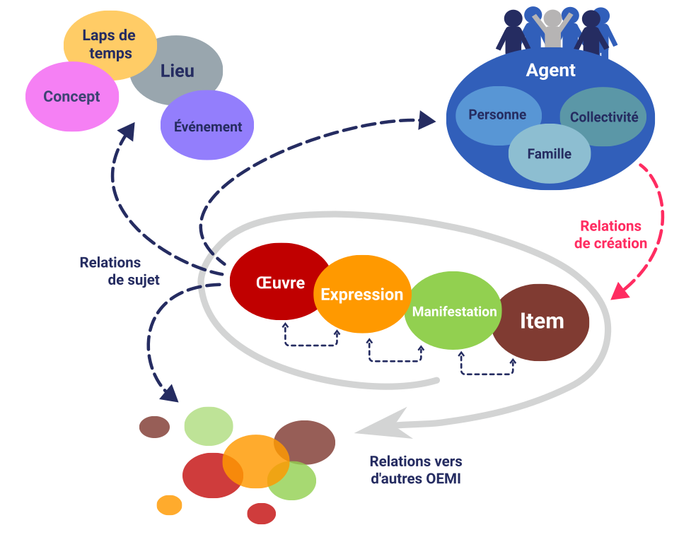
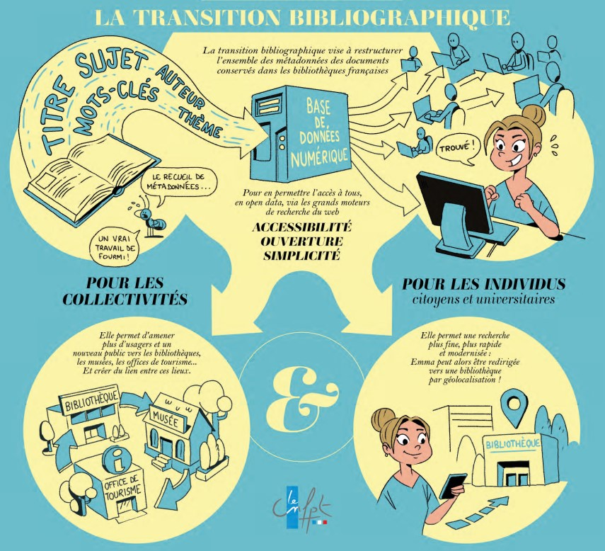

# La transition bibliographique en France, « des catalogues vers le web de données » 

---

 

<I>
Source : Carte des bases de données du projet Linked Open Data, disponible sur le 
<a href="https://www.flickr.com/photos/itupictures/16662336315">Portail Web Sémantique de Wikipédia</a> 
et vue d'un meuble à fiches par 
<a href="https://unsplash.com/fr/photos/un-gros-plan-dun-ordinateur-ST4jAHVCEZQ">D. Forsman sur Unsplash</a>
</I>

---

## Introduction - Dans l'historique des catalogues : des _Principes de Paris_ à la transition bibliographique, une adaptabilité perpétuelle

« L’ "ouvrage bibliographique" a constamment été remis sur le métier » écrit en 2017 le conservateur général des bibliothèques Grégory Miura[^1], précisant que « le catalogage reste une pierre angulaire de notre métier non par la permanence de sa structure, acquise de fraîche date, mais bien par **la vitalité d’un chantier intrinsèquement actif** ». En effet, conséquence de l'évolution des supports et canaux de la connaissance, l’histoire des catalogues de bibliothèque, à la fois outils de gestion et espaces d’interaction avec les usagers, est celle d’adaptations constantes pour **rendre visibles et intelligemment accessibles les informations** dont les bibliothèques disposent, physiquement ou numériquement. Car les catalogues actuels sont déjà la conséquence d’une première transition bibliographique visant à une **normalisation internationale du catalogage**, démarrée avec l’adoption des [**_Principes de Paris_**](https://www.ifla.org/files/assets/cataloguing/IMEICC/IMEICC1/statement_principles_paris_1961-fr.pdf) en octobre 1961, et concrétisée sur le territoire français par une série de normes (Z44) entre 1988 et 2007. D'après ces principes, le catalogue doit permettre (1) de savoir si la bibliothèque dispose d'un livre particulier, et (2) d'identifier les œuvres d'un auteur donné disponibles dans le fonds, en précisant l'édition. Pour cela, chaque livre est associé à une ou plusieurs notices descriptives, recensant toutes les indications jugées indispensables à l'identification d'un ouvrage. Mais ces standards apparaissent vite dépassés dès le tournant du XXIe siècle, alors que la multiplication des « **nouveaux supports** » (documents sonores, vidéocassettes, édition numérique…) et l’explosion du fait numérique reposent la question des formats bibliographiques et de leurs objectifs. En 1990, à Stockholm, le _Séminaire sur les notices bibliographiques_ commandé par la Fédération internationale des associations et institutions de bibliothèques ([**IFLA**](https://www.ifla.org/about/)) débouche ainsi sur la conceptualisation d'un modèle général réorganisant les données bibliographiques pour les rendre plus accessibles et lisibles : ce sont les règles **FRBR** (_Functional Requirements of Bibliographic Records_),  achevées en 1997 et publiées l'année suivante. Pour permettre la mise en application de ces règles, la Bibliothèque du Congrès élabore dans les années qui suivent le code **RDA**, _Ressource Description and Access_(2010), cependant jugé insuffisant par les agences nationales bibliographiques françaises, qui choisissent de l'adapter avant de l'implémenter. Le terme de **transition bibliographique**, polysémique, renvoie donc tout à la fois à un projet et à son application technique. Au sens strict, il s'agit d'un programme national lancé depuis 2014 pour l'élaboration d'une version française des normes RDA. Mais au sens large, la transition bibliographique s'intègre dans un mouvement mondial, initié au cours des années 90 pour adapter la structure des catalogues de bibliothèques à l'évolution du web, et interconnecter les informations qui y sont contenues. En cela, la transition bibliographique s'inscrit également à plus large échelle dans le processus international d'ouverture et de diffusion des données à caractère scientifique, alors que s'achève en France le déploiement du [**Deuxième plan pour une science ouverte**](https://www.enseignementsup-recherche.gouv.fr/fr/le-plan-national-pour-la-science-ouverte-2021-2024-vers-une-generalisation-de-la-science-ouverte-en-48525) (2021-2024). 

# I. Percer les secrets de la transition bibliographique
 
## I.1. Des objectifs parfois ambigus : s’adapter à l’évolution numérique pour mieux servir l’usager, ou répondre à l'appel du _big data_ ? 

>  « La nature de l'information, jusque-là conceptualisée à partir du modèle de l'imprimé, se transforme sous l'influence de la production numérique, à la fois fluide, diversifiée dans ses sources, ses contenus, ses formats, massive et hypertextualisée. (…) L'enjeu de la TB [Transition bibliographique] étant au final de concevoir et d'appliquer les principes, les méthodes et les outils qui permettront d'**injecter dans l'univers des données l'ensemble des artefacts documentaires collectés et décrits à ce jour**, quelle que soit leur forme ou leur origine », David Aymonin, directeur de l'Abes[^2]

### Pourquoi la transition bibliographique ?
Comme le synthétise David Aymonin, la transition bibliographique poursuit deux objectifs complémentaires. Le premier répond à une logique de service : il s'agit de **restructurer la donnée bibliographique pour la rendre mieux exploitable aux regards des demandes des utilisateurs**, qu'ils soient étudiants, chercheurs, ou lecteurs des bibliothèques municipales. En effet, l'essor d'Internet puis du web a largement remodelé les pratiques de la recherche documentaire. Les moteurs de recherche, d'une utilisation très intuitive, sont capables d'interpréter des requêtes aux formulations très variées, et ont en conséquence pris largement le pas sur les applications dédiées. Dès lors, afin que les catalogues de bibliothèques demeurent des bases de connaissances[^3] et ne soient pas réduits à de simples outils de localisation des ressources, il faudrait pouvoir **interroger le catalogue** à la manière d'un moteur de recherche, pour accéder plus rapidement à une information précise, qu'elle porte directement sur les collections d'une bibliothèque ou non : « (…) quand l'usager demande un auteur, un lieu ou un titre, il importe de lui fournir ce qu'il demande, et non plus seulement une liste de notices décrivant des documents au sein de laquelle il découvrira peut-être sa réponse » (Frédérique Joannec-Seta et David Aymonin[^4]).
Autrement dit, le catalogue ne doit plus se concevoir comme le reflet de la collection physique d'une institution[^5], mais comme un gisement de données en propre, permettant la recherche et l'exploitation d'informations au-delà de celles servant à l'étiquetage d'un exemplaire précis. La variété des usages que l'on pourrait en faire peut être illustrée par cette série de dialogues fictifs, issus d'une [infographie](https://www.transition-bibliographique.fr/wp-content/uploads/2022/10/infographie-TB.pdf) destinée à vulgariser les enjeux de la transition bibliographique auprès du grand public : 

> « - Pour ma thèse en histoire, j’ai besoin de la liste complète des éditions de Voltaire au XVIIIe siècle.  
    - _Il vous suffit de chercher la fiche Voltaire issue du fichier national des entités._ »  
  « - J’aimerais connaître les principaux auteurs ayant travaillé sur la chimie moléculaire.  
    - _Une recherche par sujet me permettra de vous dire quels sont les auteurs les plus souvent associés à ce sujet._ »
  « - Pour mon exposé sur Darwin, commençons par une recherche Google…  
    - _Tiens, il y a des documents sur le sujet à la bibliothèque. C’est donc à cela qu’elle sert ?_ »  
  « - Ce livre a l’air intéressant, qu’en pense Google ?   
    - _Il est dans la bibliothèque près de chez moi !!_ »

En effet, les catalogues brassent une somme extrêmement importantes de « **métadonnées** » (les informations permettant de décrire les caractéristiques d'autres données[^6]), qui sont en réalité parfois recherchées pour elles-mêmes, mais actuellement sous-exploitées car mal liées entre elles. En ce sens, la transition bibliographique s'inscrit très nettement dans la constitution et l'horizon d'un [**web sémantique**](https://www.w3.org/2001/sw/), notion inventée par Tim Berners-Lee[^7] (considéré comme le principal inventeur du web) et notamment développée avec James Hendler et Ora Lassila en 2001 dans [un article fondateur](https://www.lassila.org/publications/2001/SciAm.pdf)[^8]. Le web sémantique « repose sur l'établissement de **liens directs et signifiants**, c'est-à-dire interprétables par une machine, de (méta)donnée à (méta)donnée au sein d'un "**web de données**" », selon les mots de Philippe le Pape[^9]. Il s'agirait en fait de permettre aux machines de comprendre la sémantique, c'est-à-dire d'avoir accès au sens de l'information disponible sur le web, tandis que le **web de données** renvoie au projet de relier et structurer les données du web pour former un réseau global d'information. Les bibliothèques peuvent y participer, notamment : 
- par la délivrance d'[**identifiants pérennes**](https://www.bnf.fr/fr/mediatheque/les-identifiants-definition-et-enjeux-pour-les-bibliotheques), c'est-à-dire d'adresses Internet particulières permettant de citer une ressource numérique à l'aide d'un lien hypertexte, tout en ayant la garantie que ce lien ne risque pas de changer ;
- et par la constitution de **référentiels d'autorités** (une [autorité](https://www.enssib.fr/services-et-ressources/questions-reponses/thesaurus-liste-dautorites) désignant en documentation un point d'accès contrôlé, structuré et normalisé permettant de retrouver une ressource dans un catalogue).

---

<I><B>Tim Berners-Lee</B>, Source : </I><a href="https://www.flickr.com/photos/itupictures/16662336315">Flickr</a>

---

En conséquence, il faut donc également que **les données bibliographiques soient visibles sur le web**, pour que les utilisateurs puissent aisément y accéder et s'en servir. « Dans le domaine du catalogage, le défi fondamental auquel les bibliothèques sont confrontées est l'exposition et la visibilité de leurs collections et de leurs métadonnées sur le web » peut-on ainsi lire dans le [communiqué de 2014](http://transition-bibliographique.fr/wp-content/uploads/2015/05/communique201411_transition_bibliographique.pdf) annonçant la transition bibliographique. Mais sur ces dernières années, cet objectif de visibilité constamment réaffirmé semble avoir eu dans une certaine mesure tendance à effacer ou reléguer au second plan l'objectif pourtant premier de service aux utilisateurs, incitant certains professionnels de l'information scientifique et technique à la prudence quant à une possible course au _big data_ : 

> « Avec ces plateformes [Amazon, eBay, Facebook, YouTube…], le modèle technologique s'est imposé comme un composant incontournable du projet public ou privé qui visera avant tout à faire croître la fréquentation (…). Dans les bibliothèques numériques culturelles, éducatives, scientifiques, etc. en libre accès, pour lesquelles les accès ne renseignent guère sur la façon dont les internautes s’approprient et exploitent les contenus, les réflexions d’amélioration sur la convivialité et l’acceptabilité ont été ignorées au profit du prestige dont bénéficient les technologies du Web et plus particulièrement l’interopérabilité technologique. Cette interopérabilité qui a propulsé sur le devant de la scène technologique les services Web est largement promue par les équipes informatiques qui y projettent la solution idéale d’augmentation de trafic sur les sites Web en ligne. **Appliquées aux bibliothèques numériques, cette interopérabilité instrumentée par les services Web installe un processus de "coopération-compétition" entre plusieurs bibliothèques numériques, qui relègue au second plan les questions d'utilisabilité et d'acceptabilité** », Fabrice Papy et Edwige Pierot[^10]

Dans un article intitulé « la transition bibliographique en France : à qui profite le changement ? »[^11], Fabrice Papy et Edwige Pierot alertent contre une forme de captation du programme de la Transition bibliographique par l'Agence bibliographique de l'enseignement supérieur ([Abes](https://abes.fr/l-abes/presentation/)) et la Bibliothèque nationale de France ([BnF](https://www.bnf.fr/fr/missions-et-organisation-de-la-bnf)) placées à la tête du projet, pour mieux servir leurs stratégies globales et personnelles en termes d'_open data_. Sans remettre en cause la nécessité d'une évolution du catalogage face à l'essor du web, ils rappellent la diversité qui caractérise les bibliothèques françaises (la taille et la composition des fonds variant sensiblement d'un établissement à l'autre, qu'il s'agisse de bibliothèque universitaire, de recherche, patrimoniale ou de lecture publique). Une diversité en termes de services offerts et de moyens disponibles qui ne doit pas disparaître derrière la trajectoire tracée par les deux agences bibliographiques nationales, particulièrement singulières par la richesse de leurs collections et leur position de leaders (cf. remarque ci-dessous, I.2.1.1.). 
	
## I.2. Les défis de la mise en œuvre technique en France 
	
Que l'objectif final soit la visibilité ou le service aux usagers (en réalité complémentaires), l'intégration des catalogues de bibliothèque au web de données nécessite de nouveaux cadres conceptuels (FRBR, IFLA-LRM) tout autant que de nouveaux protocoles et de nouvelles opérations (production de métadonnées, utilisation de référentiels d'autorités). Définition et adoption de ces nouvelles manières de faire engendrent par voie de conséquence des mutations techniques, les systèmes informatiques de gestion des bibliothèques (SIGB) devant adapter leurs structures de bases de données pour les rendre compatibles. 

### I.2.1. FRBR, IFLA-LRM, RDA-FR… au cœur de la machine 

#### I.2.1.1. À la source : [le modèle FRBR](http://www.enssib.fr/bibliotheque-numerique/documents/65520-comprendre-le-modele-frbr-et-ses-extensions.pdf), texte fondateur de la transition bibliographique

> « (…) Si le catalogue d'une bibliothèque constituait auparavant une base de notices attachées à des "documents", il se compose désormais d'un ensemble hétérogène de "données" prises dans des relatons signifiantes conceptualisées au moyen de la syntaxe RDF (…). **Plus qu'une simple description de documents isolés, le catalogage devient une opération de conceptualisation de liens** : les bibliothèques engagées dans la Transition bibliographique avancent de fait vers cet objectif de "sémantisation" des données de leurs catalogues. » (Gabriel Raupp[^12])

Ni norme, ni format de catalogage, les FRBR publiées par l'IFLA en 1998 sont une [modélisation conceptuelle](https://www.transition-bibliographique.fr/wp-content/uploads/2016/01/support_formation_modelisation_frbr.pdf) de l'information contenue dans les notices bibliographiques, pensée pour l'utilisateur afin de répondre aux enjeux précédemment évoqués. Jusqu'alors, une notice bibliographique correspondait à une suite d'informations (structurées mais **isolées** les unes des autres) décrivant une ressource physique donnée (CD, livre, affiche…) disponible au sein d'une institution. Progressivement se sont également constitués, pour certains systèmes, des fichiers dits "d'autorités" recensant des entités normalisées (par exemple des personnes ou des collectivités) et liés aux notices bibliographiques. C'est cette mise en relation que développent les FRBR : les ressources imprimées et numériques sont regroupées en quatre entités globales, via une réorganisation complète des informations contenues dans l'habituelle description d'un objet bibliographique. 
L'ensemble est synthétisé par le sigle **OEMI : Œuvre, Expression, Manifestation et Item**, censé pouvoir rendre compte de toute ressource bibliographique : une **œuvre** donnée (c'est-à-dire une création intellectuelle ou artistique, par exemple _Notre-Dame de Paris_, de Victor Hugo), peut avoir différentes **expressions** (le texte de Victor Hugo diffère entre sa première publication en 1831 et la seconde en 1832, augmentée de trois chapitres, il a par ailleurs été traduit en langue étrangère, etc…). Ces expressions se matérialisent par différentes **manifestations** (il s'agit le plus souvent d'une publication), et chaque exemplaire isolé d'une manifestation est un **item** (par exemplaire, l'exemplaire Gallimard de Notre-Dame de Paris, dans la collection de la _Pléiade_, possédé précisément par la bibliothèque municipale du Plessis-Robinson en Île-de-France).

---

<I><B>Passage d'une logique de notices... : </B></I>
  

  

<I><B>... à une logique d'entités et de relations (catalogage par entités OEMI appliquant les règles RDA-FR) : </B></I>
   

  
 

<I> Source : site de la <a href="https://www.transition-bibliographique.fr/enjeux/definition-rda/">Transition bibliographique</a></I>
 

---

<ins>Remarque</ins> : Cette conceptualisation en OEMI modifie en profondeur la notion de collection de bibliothèque telle qu'on l'entendait jusqu'alors. La hiérarchisation complexe des entités, enchâssées les unes dans les autres, efface sensiblement la dimension physique des fonds de bibliothèque : l'entité-vedette Œuvre ne renvoie à aucun élément matériel concret pour les usagers des bibliothèques, et la notion d'exemplaire, centrale auparavant, n'apparait plus que dans la dernière entité Item. Si cette absence de matérialité correspond en grande partie à la réalité de l'Abes et de la BnF, cela peut s'avérer déroutant pour le réseau étendu des bibliothèques universitaires et de recherche, mais aussi de lecture publique, où « l'ancrage spatial » des collections demeure une réalité prégnante pour le public comme pour les professionnels[^13].

Les FRBR se cantonnent aux seules notices bibliographiques. En 1999 puis 2005, deux groupes d'experts sont constitués (**FRANAR**, _Functional Requirements and Numbering of Authority Records_ puis **FRSAR**, _Functional Requirements for Subject Authority Records_) pour étendre et affiner ce premier travail de modélisation… : 
- …<ins>Aux contenus des notices d'autorités</ins>, c'est-à-dire aux différents agents qui sont liés à une œuvre (par des opérations diverses : création, transformation, publication, possession…)  : c'est le modèle **FRAD** (_Functional Requirements for Authority Data_), [traduit en français par la BnF](https://multimedia-ext.bnf.fr/pdf/frad_rapport_final.pdf), concentré sur les relations entre les entités Personne, Collectivité, Famille et Oeuvre ;
- …<ins>Aux relations entre données bibliographiques et fichier d'autorité matière</ins>, dans l'objectif de préciser le contenu de l'œuvre elle-même. Le modèle [**FRSAD**](https://multimedia-ext.bnf.fr/pdf/frsad_rapport_final.pdf) (_Functional Requirements for Subject Authority Data_) vient ainsi analyser les liens entre une Œuvre donnée et les sujets qu'elle traite, ainsi que les informations contenues dans les systèmes d'indexation (qu'il s'agisse des concepts eux-mêmes que des appellations qui s'y réfèrent)[^14]. 

Enfin, FRBR, FRAD et FRSAD ont fusionné en 2017 pour former le modèle unique [**IFLA-LRM**](https://www.ifla.org/files/assets/cataloguing/frbr-lrm/ifla-lrm-august-2017_rev201712.pdf) (_IFLA Library Reference Model_) sur lequel s'adosse le programme actuel de la Transition bibliographique en s'inscrivant plus directement dans une perspective de web de données. Il regroupe les trois niveaux d'entités (organisées en classes et sous-classes) précédemment évoqués : celui de l'œuvre ("groupe 1", très proche des OEMI de FRBR), celui des entités responsables du contenu ("groupe 2" : Personne, Famille, Collectivité, liées principalement à FRAD) et enfin celui des entités dites Sujet ("groupe 3": Concept, Objet, Évènement et Lieu), ainsi que l'illustrent les schémas suivants : 

---

<I><B>Représentation simplifiée des relations dans IFLA-LRM</B>, Source : </I><a href="https://code.rdafr.fr/wp-content/uploads/2023/06/modele-de-description-rda-fr.png">site RDA-FR</a> 

---

<I><B>Vue d'ensemble des relations dans le modèle IFLA-LRM</B>, Source : </I><a href="https://www.ifla.org/files/assets/cataloguing/frbr-lrm/ifla-lrm-august-2017_rev201712.pdf">IFLA Library Reference Model,</a> IFLA, 2017, p.86
 

---

Son architecture globale est censé répondre à cinq type d'opérations : **explorer, trouver, sélectionner, identifier, obtenir**, et correspond à un formalisme d'**ontologie**[^15]. Si IFLA-LRM répond aux deux objectifs de service à l'utilisateur et de visibilité des données, ce n'est cependant qu'un modèle conceptuel, général, et non pas une application. 

#### I.2.1.2. "L'adopter, c'est l'adapter", de RDA à [RDA-FR](https://www.transition-bibliographique.fr/enjeux/definition-rda/) : le lancement du programme Transition bibliographique

De nouvelles règles ont donc vocation à progressivement remplacer les [normes de catalogage Afnor](https://www.bnf.fr/fr/normes-afnor-de-catalogage) jusqu'alors en cours, pour appliquer et concrétiser les nouvelles conceptualisations des données bibliographiques. En effet, puisqu'il ne s'agit plus de créer des liens entre des pages mais de « **lier des données structurées**, si possibles ouvertes et identifiées de manière pérenne » (selon la formulation de Gabriel Raupp[^16]), il faut disposer d'une syntaxe normalisée et standardisée qui permette de le faire. En 2009 était déjà paru REICAT (_Regole Italiane di CATalogazione_), puis l'année suivante **RDA, _Ressource Description and Access_**, créé par la Bibliothèque du Congrès avec une vocation internationale. Cependant, ce dernier code, basé quasi-exclusivement sur les FRBR et resté très proche des [AACR](http://www.aacr2.org/) américaines (_Anglo-American Cataloguing Rules_), n'est pas assez abouti selon l'Abes et la BnF. En 2014, le choix est fait d'adapter progressivement le code RDA aux normes françaises, avec la rédaction de **RDA-FR** : c'est le lancement officiel du programme national de la transition bibliographique. 

> « (…) il est possible et préférable d'avancer **progressivement mais concrètement** vers la FRBRisation des catalogues sans attendre le grand soir de l'adoption de RDA. Cette approche conduit à ajuster l'organisation du travail existante au sein de RDA en France [_rq_ : le groupe de travail chargé d'évaluer le code RDA, pendant national du groupe européen EURIG], **renommé "Transition bibliographique"** afin d'inscrire la problématique de l'évolution des règles de catalogage dans un plus large mouvement d'évolution qui nécessite une démarche d'ensemble d'accompagnement au changement dans les établissements » ([Communiqué de presse](http://transition-bibliographique.fr/wp-content/uploads/2015/05/communique201411_transition_bibliographique.pdf) annonçant le lancement du programme Transition bibliographique, 2014)

Presque dix ans plus tard, dans un autre [communiqué de presse de novembre 2023](https://www.bnf.fr/sites/default/files/2023-11/cp_Transition_bibliographique_2023.pdf) l'Abes et la BnF réaffirment ainsi les trois axes du projet : « améliorer l'exposition des données bibliographiques françaises dans le web de données par l'application du modèle international de données IFLA-LRM  »  (qui a depuis 2017 remplacé FRBR et ses différentes évolutions, obligeant à une **refonte du code de catalogage RDA**), « adopter pour ce faire de nouvelles règles de signalement et de description des documents et des autorités y étant liées (auteurs, sujets, lieux…), dérivées du code de catalogage international RDA, le code RDA-FR » et enfin « préparer l'ensemble des acteurs de l'écosystème national à cette transition normative et technologique par des actions de communication, de sensibilisation et de formation ».

Au cœur de la transition bibliographique, le code RDA-FR doit donc permettre, par l'implémentation du modèle IFLA-LRM, de produire de meilleures métadonnées, essentielles dans la création et la diffusion de l'information bibliographique, de s'adapter à l'information numérique en prenant en compte tout type de ressource et tout type de mode de recherche, mais également d'améliorer la communication avec les jeux de données d'autres communautés productrices de savoir, afin de gagner en en **interopérabilité** (terme désignant la « capacité d'un produit ou d'un système, dont les interfaces sont intégralement connues, à fonctionner avec d'autres produits ou systèmes existants ou futurs, et ce sans restriction d'accès ou de mise en oeuvre »[^17]).

#### I.2.1.3. Un temps long nécessaire
État intermédiaire entre deux paradigmes par définition, la « transition » bibliographique s'inscrit donc nécessairement sur le long terme, l'un de ses piliers fondamentaux étant l'idée de **progressivité**. La norme RDA-FR est rédigée et publiée chapitre après chapitre, au fur et à mesure de sa validation par le groupe **AFNOR CN46-9**, et doit être intégrée dans les formats de catalogage existants, nécessitant d'indispensables adaptations techniques (« les outils doivent tenir compte aussi bien des évolutions normatives que du changement de paradigme dans la production et la gestion des données »[^18]). Il s'agit aussi de former les catalogueurs au nouveau code, et de sensibiliser public et responsables d'établissements aux impacts de la transition bibliographiques.

> « Le temps de la transition bibliographique est d'autant plus complexe que le contexte est celui de l'automatisation partielle des processus afin de traiter des lots de données de plus en plus volumineux ; ce travail sort du quotidien des informaticiens pour devenir celui des _data librarians_ ; la production des métadonnées se répartit sur un nombre croissant d'acteurs » (Frédérique Joannic-Seta, David Aymonin[^19])

### I.2.2. L’infrastructure institutionnelle 

Les acteurs de la transition bibliographique sont nombreux, regroupant tant des professionnels de bibliothèques et de centres d'archives, que des éditeurs d'applications et de logiciels professionnels. Le programme global est défini par le **Comité stratégique des bibliothèques**, rassemblant l'Abes et la BnF (les directeurs des deux agences bibliographiques nationales pilotant le projet), ainsi que des représentants de leurs deux ministères de tutelle, le **Ministère de la culture et de la communication** et le **Ministère de l'éducation nationale, de l'enseignement supérieur et de la recherche**. Ce comité se réunit deux fois par an. Le projet est ensuite coordonné collégialement entre trois groupes de travail nationaux : **Normalisation**, **Formation** et **Systèmes de données**, échangeant périodiquement lors de réunions en assemblée plénière.

---

<I><B>Organigramme du programme Transition bibliographique</B>, Source : Arabesques n°87, 2017, p.07</I>
 

---
Sous l'égide de la commission « Identification et description » de l'AFNOR, le groupe « <ins><B>Normalisation pour l'adoption de RDA en France</B></ins> » a pour mission principale la rédaction et la publication de RDA-FR, en s'appuyant autant que possible sur RDA afin de rester proche de la communauté internationale des bibliothèques. Ainsi, l'équipe contribue parallèlement aux propositions portées par le groupe d'intérêt européen sur RDA **EURIG**, d'abord au **JCS** (_Joint Steering Committee for Development of RDA_), puis depuis 2015 aux **RSC** (_RDA Steering Committee_) et **RDA Board**. Ces instances, regroupant des représentants des six principales régions du monde (Afrique, Amérique latine et Caraïbes, Amérique du Nord, Asie, Europe et Océanie), ont été créées pour répondre à l'internationalisation progressive de RDA au fur et à mesure de sa traduction, et donc à l'exigence d'une représentation géographiquement plus équilibrée au sein du pilotage du projet.
Le principal enjeu de ce pilotage est de réussir à conserver une **cohérence tout au long du code** (notamment en anticipant vers les parties non encore éditées) alors que la rédaction s'échelonne sur plusieurs années et qu'RDA est régulièrement mis à jour. La mise en conformité avec IFLA-LRM notamment obligeait à revenir en amont pour corriger les passages du code déjà édités, tout en anticipant le changement de vision des parties à venir.  
Par ailleurs, en anticipation de la publication, le groupe propose également des évolutions intermédiaires pour répondre à des besoins plus urgents et concrets et travaille en étroite collaboration avec le groupe **Formation** pour rédiger des documents pédagogiques, notamment en participant au [Guide pratique du catalogueur de la BnF](https://editions.bnf.fr/guide-pratique-du-catalogueur) et au [Guide méthodologique du Sudoc](https://documentation.abes.fr/sudoc/).

En effet, le groupe [**Formation**](https://www.transition-bibliographique.fr/se-former/modalites-pratiques/) mène en parallèle un important chantier de sensibilisation aux enjeux de la transition bibliographique et des évolutions du catalogage : il s'agit à la fois d'expliciter les tenants et aboutissants du programme, et d'accompagner la nécessaire montée en compétence des équipes-métiers de catalogueurs, la transition bibliographique remodelant à la fois la conception même du catalogage et les pratiques et techniques concrètes d'enregistrement de l'information bibliographique. 
Ce travail est mené de pair avec trois importantes structures du monde de la documentation : le [**CRFCB**](https://www.crfcb.fr/#/) (Centre Régional de Formation aux Carrières des Bibliothèques), l'[**ENSSIB**](https://www.enssib.fr/) (l'Ecole Nationale Supérieures des Sciences de l'Information et des Bibliothèques) et le [**CNFPT**](https://www.cnfpt.fr/nous-connaitre/nos-missions/champs-daction/national) (Centre National de la Fonction Publique Territoriale). 

---

<I><B>Extrait d'un support de sensibilisation du CNFPT</B>, Source : </I><a href="https://www.cnfpt.fr/sites/default/files/transition_bibliographique-tb_def_logo_couleur_vf.pdf">site du CNFPT</a>

---

Enfin, en concertation avec les développeurs, le groupe <ins><B>Systèmes et données</B></ins> est chargé de la mise en place des outils professionnels permettant le passage à RDA, afin que puisse s'opérer la migration des données des catalogues actuels vers les catalogues respectant le nouveau cadre conceptuel de structuration de l'information bibliographique, l'enjeu étant à terme de pouvoir **produire des données nativement « LRMisées »**. Il s'agit de répondre sous l'angle informatique aux nombreuses questions pratiques que soulève la transition bibliographique, et notamment : comment gérer la création des nouvelles entités et l'imbrication complexe des différentes relations ? Il faut pouvoir faire évoluer les **SIGB** (Système Informatisé de Gestion des Bibliothèques) mais également les formats de données. Dans cette optique, le groupe a notamment développé le logiciel [**Bibliostratus**](https://www.transition-bibliographique.fr/systemes-et-donnees/bibliostratus-presentation/) accessible gratuitement, pour faciliter l'alignement des données bibliographiques au sein des catalogues avec celles de la BnF et du Sudoc.

### I.2.3. « MARC must die » : les métadonnées de l’avenir  

Outre le cadre de la description bibliographique (FRBR et IFLA-LRM) et les normes de catalogage (RDA-FR), le programme de la transition bibliographique invite également à réinterroger les formats dans lequel les données sont gérées, toutes variantes du **MARC** (_MAchine-Readable Cataloging_). Cette famille de formats d'échanges de données bibliographiques avait été développée sur demande de la Bibliothèque du Congrès à la fin des années 1960, aux débuts de l'informatique, pour [rendre les notices catalographiques lisibles par des machines](https://www.marc21.ca/M21/040010-237.1-f.html). 
Le MARC repose sur des grilles de saisie (on parle de « zones », dédiées à la saisie de l'auteur, du titre, de la cote…) attribuant des étiquettes ou balises à toutes les parties composant habituellement une notice de catalogage (par exemple, dans le format MARC21 employé par la Bibliothèque du Congrès, l'étiquette numérique **100** indique que la zone contient un nom de personne désignée comme vedette principale, c'est-à-dire le plus souvent un auteur, et l'étiquette **245** indique un titre). Plus précisément, MARC est moins un format informatique qu'une **norme de description bibliographique**, dont dépend la description, l'organisation et l'affichage des informations dans un catalogue de bibliothèque. Pour être exportées et chargées dans un autre catalogue, les informations bibliographiques écrites en MARC sont recodées selon la norme [**ISO 2709**](https://www.enssib.fr/services-et-ressources/questions-reponses/notices-codees-format-marc-et-norme-iso-2709). Depuis les années 60, de nombreuses variantes du MARC ont été développées, dont [**UNIMARC**](https://www.transition-bibliographique.fr/unimarc/formats-unimarc/) développé par l'IFLA et **MARC21** maintenu par la Bibliothèque du Congrès. 
Si une évolution du MARC est suggérée depuis longtemps (« MARC Must Die », écrivait Roy Tennant en 2002[^19]), il n'a jamais été sérieusement remis en cause, y compris lors du tournant de 2017 pour l'adoption d'IFLA-LRM. En effet, outre la nécessité de s'accorder à l'échelle de l'ensemble de la communauté, mettre en cause le MARC imposerait de convertir des millions de notices déjà encodées. Et pourtant, les défauts des formats MARC ne sont que trop visibles (bien qu'à nuancer selon les adaptations locales qui ont depuis pu être mises en oeuvre[^21]) : formatés pour un regard humain, les données structurées en MARC se prêtent mal aux processus automatisés de traitement et de récupération [^22] et sont en conséquence peu compétitifs dans le web de données.

> « Le format de notices le plus répandu, nommé MARC, utilise un vocabulaire et une codification très spécifique au métier bibliographique, rendant difficile la réutilisation des données par d'autres acteurs. De plus, MARC est principalement dédié à la représentation de publications littéraires (ex., livres) comme on pourrait les imaginer sur une étagère. Ce paradigme reste malheureusement loin de la réalité numérique grandissante (ex., ebooks, web séries, podcasts) et des possibilités du Web Sémantique pour décrire des relations riches entre des documents (ex., adaptations, traductions, illustrations). », Joffrey Decourselle[^23]

Plusieurs expérimentations ont déjà été menées[^24] : 
- Dès 2009 débute une réflexion initiée par l'IFLA, puis poursuivie par RDA pour créer des espaces de noms permettant de déclarer les entités et relations des FRBR sous la forme d'une ontologie utilisable dans le web sémantique 
- Le projet [DOREMUS](https://www.doremus.org/) est mis en place conjointement par une série d'institutions (dont la Cité de la Musique et la Philharmonie de Paris) pour rendre compte des œuvres musicales et de leurs différentes expressions et manifestations 
- En 2012, la Bibliothèque du Congrès lance [**BIBFRAME**](https://publications-prairial.fr/arabesques/index.php?id=639) (_Bibliographic Framework Initiative_), initialement pour remplacer MARC 21. Le projet LD4P (_Linked Data For Production 4_) tente depuis de compléter et de tester ce nouveau format, censé permettre la pleine application de RDA grâce à la création des liens entre les données. 
En France (où dominent les formats Unimarc et Intermarc), la BnF, ayant démarré en 2017 la refonte de ses outils de catalogage a lancé une nouvelle version d'**Intermarc** pour produire nativement des données LRMisées. Se pose également la question d'un nouveau modèle fondé sur RDF (notamment à partir du service data.bnf.fr).

---

<I><B>Etat des compatibilités entre les standards bibliographiques, dernière mise à jour en septembre 2024</B>, Source : </I><a href="https://code.rdafr.fr/schemas/schema-etat-de-compatibilite-entre-les-standards-bibliographiques/">site RDA-FR</a>

---
				 
## I.3. Quel bilan en 2024 ?
<ins><B> Rappels des principaux jalons </B></ins>
- [X] 1998 : Achèvement et publication des FRBR (_Functional Requirements for Bibliographic Records_)
- [X] 2010 : Publication du code RDA (Ressource : Description et Accès) 
- [X] 2010-2014 : Travail d'évaluation du nouveau code mené par le groupe RDA en France 
- [X] **2014 : Annonce du programme Transition bibliographique par l'Abes et la BnF**
- [X] 2015 : Mise en ligne du [site officiel](http://www.transition-bibliographique.fr/) de la transition bibliographique, qui concentre l'ensemble des informations sur le sujet, et première publication d'éléments de la section 1 de RDA-FR 
- [X] 2017 : **Publication d'IFLA-LRM** et décision d'y aligner RDA-FR ; publication de deux sections majeures du code (l'_Enregistrement des attributs des œuvres et des expressions_, qui remplace la norme AFNOR datant de 1987, et l'_Enregistrement des relations principales entre l'œuvre, l'expression, la manifestation et l'item_)
- [X] 2023 : Publication du [site web RDA-FR](https://code.rdafr.fr/5-questions-sur-le-site-rda-fr/) par le groupe de travail Normalisation pour faciliter la consultation du code 

Depuis les quelques dix ans de mise en œuvre de la transition bibliographique, on compte plusieurs grandes réalisations. Néanmoins, le travail n'est pas terminé. En particulier, la rédaction du code RDA-FR n'est pas encore achevée (manquent notamment les référentiels du "groupe 2" : Agent, Collectivité, Famille…), et un site dédié permet de suivre son avancement progressif : actuellement, une [enquête publique](https://code.rdafr.fr/lenquete-rda-fr-sur-les-concepts-court-jusquau-30-avril-2025/) est ouverte jusqu'en avril 2025 concernant les derniers chapitres mis en forme (le chapitre 12, "Recommandations sur l'enregistrement des concepts", et 33, "Relations impliquant un concept"). D'ici à la fin 2025 ou au début de l'année 2026, en déployant son nouveau catalogue [**NOEMI**](https://www.bnf.fr/fr/actualites-du-catalogue-no-51-mars-2021) (Nouer les Œuvres, Expressions, Manifestations et Items) censé permettre de cataloguer suivant le code RDA-FR grâce au nouveau format Intermarc (dit « **Nouvelle Génération** »), la BnF prévoit [d'achever en interne sa transition bibliographique](https://www.transition-bibliographique.fr/2024-10-01-trajectoire-nationale-pour-limplementation-de-la-transition-bibliographique-quelles-modalites-de-diffusion-et-recuperation-des-donnees/). Le calendrier diffère quelque peu pour l'Abes, qui entre quant à elle dans une [**période de réinformatisation**](https://vimeo.com/954829029), la première étape étant censée s'achever fin 2027.

# II. Transition bibliographique et science ouverte : des visions sécantes ?

> « Sous l’impulsion du Ministère de l’Enseignement supérieur et de la recherche et du Ministère de la Culture, [le Programme national de la Transition bibliographique] vise à faire évoluer les formats de production et de diffusion des données bibliographiques vers un modèle entités/relations favorisant la **découvrabilité des contenus scientifiques et culturels français sur le web**, leur bonne réutilisation par les intelligences artificielles et leur **contribution à l’économie de la connaissance**, au niveau national et européen » (site de la [BnF](https://www.bnf.fr/sites/default/files/2023-11/cp_Transition_bibliographique_2023.pdf))

> « La science ouverte est la **diffusion sans entrave des résultats, des méthodes et des produits de la recherche scientifique**. Elle s'appuie sur l'opportunité que représente la mutation numérique pour développer l'accès ouvert aux publications et - autant que possible - aux données, aux codes sources et aux méthodes de la recherche » « Le mouvement de la science ouverte vise à **construire un écosystème** dans lequel la science sera plus cumulative, plus **fortement étayée par des données**, plus transparente, plus rapide et d'accès universel. » (site [Ouvrir la science !](https://www.ouvrirlascience.fr/initiez-vous-a-la-science-ouverte/))

Malgré un questionnement en germe depuis 1991 et la création de l'archive ouverte [arXiv](https://arxiv.org/), la science ouverte ne s'impose à l'agenda politique français qu'autour de 2016, avec la promulgation de la [**Loi pour une République numérique**](https://www.legifrance.gouv.fr/loda/id/JORFTEXT000033202746), depuis retranscrite dans le Code de la Recherche, et qui autorise les chercheurs dont l'activité est financée au moins pour moitié sur fonds publics à déposer leur article dans une archive ouverte[footnote]. Deux ans plus tard, Frédérique Vidal annonçait le lancement du premier [**Plan national pour la science ouverte**](www.ouvrirlascience.fr), présenté en juillet 2018. Il n'est pas anodin que ce calendrier coïncide avec le lancement du programme Transition bibliographique. En effet, si la transition bibliographique désigne avant tout une mutation technologique et conceptuelle appliquée aux catalogues des bibliothèques tandis que la science ouverte est un mouvement associé à un idéal, les deux se recoupent dans une dynamique commune : **faciliter l'accès aux informations**, notamment à caractère scientifique, _via_ une meilleure exploitation des potentiels offerts par le numérique, et par la constitution d'un réseau global interconnecté de circulation et de production de l'information.

	 
## II.1. La transition bibliographique et les données FAIR 

S'il ne s'agissait pas de son objectif principal, la transition bibliographique fait cependant partie intégrante du processus nécessaire pour une véritable science ouverte, en particulier en sciences humaines et sociales où l'administration de la preuve repose en grande partie sur des renvois précis à des travaux antérieurs ou contemporains. Au cœur de la transition bibliographique, se trouvent donc des enjeux d'**interopérabilité** et d'**accessibilité** des données bibliographiques, problématiques également centrales dans l'établissement des [principes **FAIR**](https://www.ccsd.cnrs.fr/principes-fair/) de la science ouverte. Particulièrement pertinentes concernant les **données de la recherche**, ces recommandations[^25] s'appliquent de manière générale à toute ressource numérique relative à une activité scientifique et disponible en libre accès, et reposent sur l'acronyme suivant  : 

## II.2. La transition bibliographique, accélérateur ou frein à la science ouverte ? 

## Conclusion

---

### Bibliographie

<ins>Thèses et mémoires </ins>  
- Clémence AGOSTINI, « L'ABES et la BnF en route vers l’_open data_ », Mémoire de fin d'étude du diplôme de conservateur, dirigé par Gildas ILLIEN, Université de Lyon et Ecole Nationale Supérieure des Sciences de l'Information et des Bibliothèques, janvier 2015, p.52
- Joffrey DECOURSELLE, « Migration et enrichissement sémantique d'entités culturelles », Thèse dirigée par Mohan Saïd HACID et Nicolas LUMINEAU, Lyon, Université Claude Bernard Lyon 1, 2018. Disponible [en ligne](https://www.researchgate.net/publication/328955171_Migration_et_enrichissement_semantique_d'entites_culturelles).

<ins>Ouvrages</ins>
- Emmanuel BERMER, _Le Web sémantique en bibliothèque_, Electre-Editions du Cercle de la Librairie, Paris, 2013, p. 19

<ins>Articles</ins>
- Emmanuelle BERMES, « À quoi ressembleront les métadonnées de l’avenir ? », _Arabesques_ [En ligne], n°87, 2017, mis en ligne le 01 décembre 2019, [URL](https://publications-prairial.fr/arabesques/index.php?id=294)
- Véronique HEURTEMATTE, « "La science ouverte est une nouvelle façon de diffuser les savoirs, et les bibliothèques sont au cœur de cette évolution" : entretien avec Madeleine Géroudet, Julien Sempéré et Nelly Sciardis », _Bulletin des bibliothèques de France (BBF)_, 2022, [URL](https://bbf.enssib.fr/bbffocus/la-science-ouverte-est-une-nouvelle-facon-de-diffuser-les-savoirs-et-les-bibliotheques-sont-au-coeur-de-cette-evolution_70750)
- Reinhold HEUVELMANN, « Bibframe, un nouveau modèle de données pour les bibliothèques », Arabesques [En ligne], n°83, 2016, mis en ligne le 10 janvier 2020, [URL](https://publications-prairial.fr/arabesques/index.php?id=639)
- - Seungmin LEE et Elin K. JACOB, « An Integrated Approach to Metadata Interoperability », _Library Resources & Technical Services_, 55(1), 2011, p.17-32
- Fabrice PAPY et Edwige PIEROT, « La "transition bibliographique" en France : à qui profite le changement ? » _Documentation et bibliothèques 64_, 56, 2018.
- Roy TENNANT, « MARC Must Die », _Library Journal - New York_, 127(17), 2002, p. 26-27

<ins>Blogs et Sites</ins>
- Chloé FERRY, « Principes du FAIR et archives sonores : la valorisation des contenus en environnement numérique », _Carnets du master Métiers des archives et des bibliothèques : médiation de l'histoire et humanités numériques_, 22 janvier 2019, [URL](https://masterabd.hypotheses.org/5578#identifier_2_5578)
- Chiara MORETTI, « Principes FAIR et défis pour leur application dans le domaine des arts et humanités », _Carnets du master Métiers des archives et des bibliothèques : médiation de l'histoire et humanités numériques_, 04 janvier 2023, [URL](https://masterabd.hypotheses.org/9842)
- Site officiel de la transition bibliographique, [ici]()
- Site de RDA-FR (version bêta) : [ici]()
- Site de l'ABES : 
- Site de la BNF, [ici](https://www.bnf.fr/fr/programme-national-transition-bibliographique)
- Site officiel "Ouvrir la science", [ici](https://www.ouvrirlascience.fr/initiez-vous-a-la-science-ouverte/)

[^1]: Grégory MIURA, « Dernier appel pour les bibliothécaires en transit ! », _Arabesques_ [En ligne], n°87, 2017, mis en ligne le 01 janvier 2019, [URL](https://publications-prairial.fr/arabesques/index.php?id=264)

[^2]: David AYMONIN, « Vous ne direz plus jamais "lost in translation" », _Arabesques_ [En ligne], n°87, [URL](https://publications-prairial.fr/arabesques/index.php?id=212)

[^3]: Et pour que les bibliothèques puissent continuer d'assurer leur mission première, à savoir « garantir un libre accès aux savoirs et à l'information, sur place ou à distance », Christian JACOB, _Qu'est-ce qu'un lieu de savoir ?_, Open Edition Press, 2014

[^4]: Frédérique JOANNIC-SETA et David AYMONIN, « Stratégie et prospective : le mot des pilotes », _Arabesques_ [En ligne], n°87,2017, mis en ligne le 01 décembre 2019, [URL](https://publications-prairial.fr/arabesques/index.php?id=286)

[^5]: « Le catalogue en tant qu'outil de recherche associé à la réalité physique de la bibliothèque est en effet conçu pour donner une représentation de la collection, pour l'incarner. Il constitue un reflet de la collection physique pour laqulle il joue le rôle d'outil d'accès. » Emmanuel BERMER, _Le Web sémantique en bibliothèque_, Electre-Editions du Cercle de la Librairie, Paris, 2013, p. 19

[^6]: « (...) l'ajout de métadonnées, est alors devenue incontournable afin "d'optimiser l'usage du document en permettant un meilleur accès à son contenu et une meilleure mise en contexte". Les métadonnées représentent donc toutes les informations qui permettent de décrire les caractéristiques d'autres données, quel qu'en soit le support. Ce sont des **données sur les données**. (...) Dans le monde des archives et des bibliothèques, elles représentent "toutes les informations applicables à un document [et] réunies dans un document secondaire". Elles sont donc à la base de l'archivage et du traitement bibliographique. Transposées dans le monde numérique, ces métadonnées contnuent d'exister de manière dématérialisée et augmentée, permettant une **description structurée et standardisée** des ressources. » Chloé FERRY, « Principes du FAIR et archives sonores : la valorisation des contenus en environnement numérique », _Carnets du master Métiers des archives et des bibliothèques : médiation de l'histoire et humanités numériques_, 22 janvier 2019, [URL](https://masterabd.hypotheses.org/5578#identifier_2_5578)

[^7]: Parmi les premières évocations du Web sémantique : « J'ai fait un rêve pour le Web (dans lequel les ordinateurs) deviennent capables d'analyser toutes les données sur le Web - le contenu, les liens, et les transactions entre les personnes et les ordinateurs. Un "Web Sémantique" qui devrait rendre cela possible, n'a pas encore émergé, mais quand ce sera fait, les mécanismes d'échange au jour le jour, de bureaucratie et de nos vies quotidiennes seront traités par des machines dialoguant avec d'autres machines. Les "agents intelligents" qu'on nous promet depuis longtemps vont enfin se concrétiser. » Extrait de _Weaving the Web_, Tim BERNERS-LEE, 1999, traduction consultée sur le support de formation consacré à la définition du web sémantique, p.16, disponible [ici](https://www.transition-bibliographique.fr/wp-content/uploads/2016/04/Web_de_Donnees_26-02-2016_Version_Courte.pdf)

[^8]: Tim BERNERS-LEE, James HENDLER, Ora LASSILA, « The Semantic Web. A New Form of Web Content That Is Meaningful to Computers Will Unleash a Revolution of New Possibilities ». _Scientific American_, 284, 2001, p. 1-5

[^9]: Philippe LE PAPE, « Une transition chasse l’autre », _Arabesques_ [En ligne], n°87, 2017, mis en ligne le 17 juin 2019, [URL](https://publications-prairial.fr/arabesques/index.php?id=218)

[^10]: Fabrice PAPY et Edwige PIEROT, « La "transition bibliographique" en France : à qui profite le changement ? » _Documentation et bibliothèques 64_, 56, 2018.

[^11]: _Ibid_.

[^12]: Gabriel RAUPP, [Fiche pratique de l'Enssib](https://www.enssib.fr/bibliotheque-numerique/documents/67445-comprendre-les-enjeux-de-la-transition-bibliographique.pdf), 2016

[^13]: « C'est parce que leurs catalogues s'appuient sur des catalogues de plusieurs millions de notices que l'adoption du modèle FRBR et de ses versions dérivées par la BnF et l'ABES trouve tout son sens. L'ABES au travers du SUDOC constitue un catalogue bibliographique virtuel (...) qui ne correspond ainsi à aucune logique de collections pourtant bien présentes dans les bibliothèques universitaires et de recherches. La BnF recense plus de 13 millions de notices bibliographiques organisées grâce à des données sur les données et de ressources dont elle est seule à disposer en intégralité (RAMEAU, bibliothèque numérique Gallica, notices auteurs, etc.). Les fonds des bibliothèques municipales qui sont plus modestes (ils rassemblent généralement quelques dizaines de milliers de documents) ne permettront pas d'exploiter les avantages du FRBR et de restituer la richesse des relations entre les entités. » Fabrice PAPY et Edwige PIEROT, « La "transition bibliographique" en France : à qui profite le changement ? » _Documentation et bibliothèques 64_, 56, 2018.

[^14]: Voir notamment la page dédiée aux modèles FRBR, FRAD et FRSAD sur le site de la BnF, [ici](https://www.bnf.fr/fr/modeles-frbr-frad-et-frsad)

[^15]: En informatique, une ontologie désigne un ensemble structuré de concepts permettant de donner un sens aux informations (Dictionnaire Le Robert, [en ligne](https://dictionnaire.lerobert.com/definition/ontologie)

[^16]: Gabriel RAUPP, [Fiche pratique de l'Enssib](https://www.enssib.fr/bibliotheque-numerique/documents/67445-comprendre-les-enjeux-de-la-transition-bibliographique.pdf), 2016

[^17]: Définition de l'interopérabilité technique disponible sur le site [numerique.gouv.fr](https://www.numerique.gouv.fr/actualites/le-referentiel-general-dinteroperabilite-fait-peau-neuve/)

[^18]: Frédérique JOANNIC-SETA et David AYMONIN, « Stratégie et prospective : le mot des pilotes », _Arabesques_ [En ligne], n°87,2017, mis en ligne le 01 décembre 2019, [URL](https://publications-prairial.fr/arabesques/index.php?id=286)

[^19]: _Ibid_.

[^20]: Roy TENNANT, « MARC Must Die », _Library Journal - New York_, 127(17), 2002, p. 26-27

[^21]: Ces défauts n'en sont que du point de vue d'une intégration au web de données, car par ailleurs « les formats MARC sont parfaitement adaptés à l'usage qui est fait d'eux actuellement, à savoir la description d'un document. Ils permettent de rendre compte de manière fine les différents éléments d'information, de mettre en place des contrôles assez puissants et ils comportent des zones de liens. Cette finesse fait qu'il est difficile de rendre compte en RDF d'une information encodée en MARC ». Clémence AGOSTINI, « L'ABES et la BnF en route vers l’_open data_ », Mémoire de fin d'étude du diplôme de conservateur, dirigé par Gildas ILLIEN, Université de Lyon et Ecole Nationale Supérieure des Sciences de l'Information et des Bibliothèques, janvier 2015, p.52

[^22]: « the reality is that the [MARC] format (…) has been primarily intended for the exchange and display of records and the data was, to a large degree, structured for human interpretation and not for automated processing and retrieval as it is required today », Seungmin LEE et Elin K. JACOB, « An Integrated Approach to Metadata Interoperability », _Library Resources & Technical Services_, 55(1), 2011, p.17-32

[^23]: Joffrey DECOURSELLE, « Migration et enrichissement sémantique d'entités culturelles », Thèse dirigée par Mohan Saïd HACID et Nicolas LUMINEAU, Lyon, Université Claude Bernard Lyon 1, 2018, p. 16. Disponible [en ligne](https://www.researchgate.net/publication/328955171_Migration_et_enrichissement_semantique_d'entites_culturelles).

[^24]: Voir notamment Emmanuelle BERMES, « À quoi ressembleront les métadonnées de l’avenir ? », _Arabesques_ [En ligne], n°87, 2017, mis en ligne le 01 décembre 2019, [URL](https://publications-prairial.fr/arabesques/index.php?id=294)

[^25]: « Les principes FAIR sont le fruit d'une réflexion qui s'est développée en 2014 à Liden (Pays-Bas) dans le cadre d'un workshop qui a pour résultat la publication du [Data FAIRport open initiative](https://www.datafairport.org/). En 2016, la revue scientifique _Scientific Data_ est parvenue à la formulation qui réunit les 4 lettres : **F**indable, **A**ccessible, **I**nteroperable, **R**eusable pour une production une gestion efficace et une réutilisation des données de recherche », Chiara MORETTI, « Principes FAIR et défis pour leur application dans le domaine des arts et humanités », _Carnets du master Métiers des archives et des bibliothèques : médiation de l'histoire et humanités numériques_, 04 janvier 2023, [URL](https://masterabd.hypotheses.org/9842)
